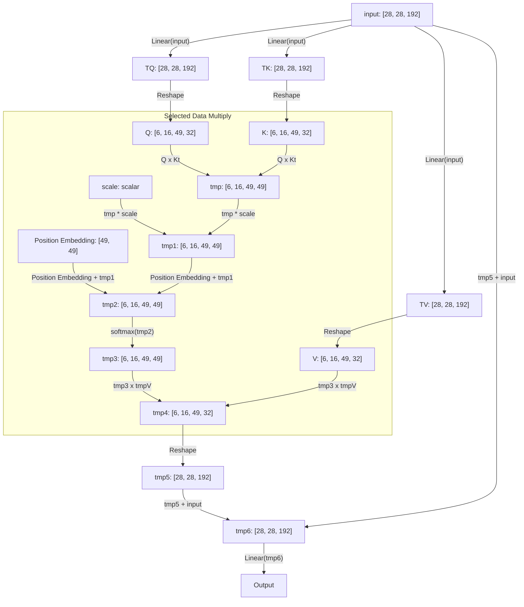
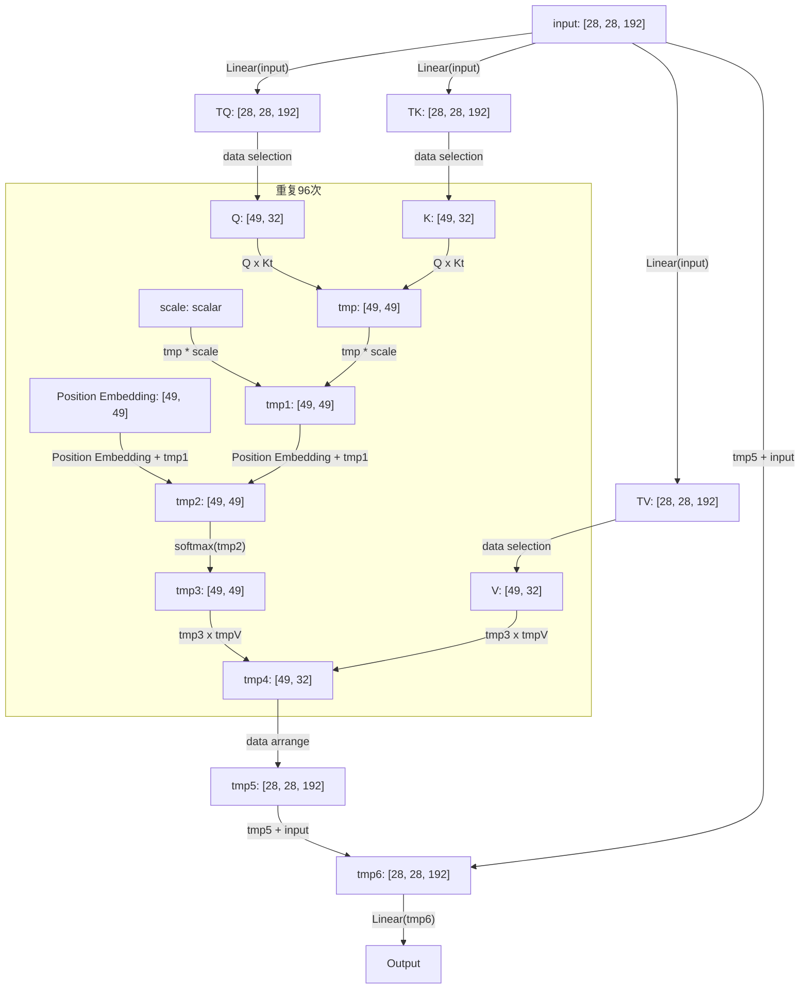
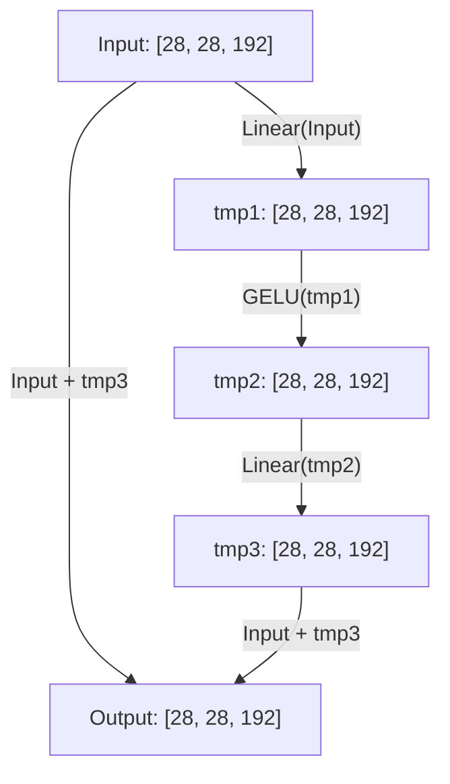

# Swin Transfomer

---
[TOC]
## Overall Structure


## Stage Module (Use module 2 as example)


### Partition Merge


#### Unfolder Reshape

实际上Unfold的作用如下图所示

@import "http://cdn.dianhsu.top/img/20210524135033.svg" {width=500}

输入数据是一个 $H,W,C$ 的立方体，Unfolder Reshape的作用是将它切分成 $ds, ds, C$ 的小立方体。那么立方体的个数是$\frac{W \times H}{ds^2}$，将小立方体的数据排成一排。得到的输出就是$[\frac{W \times H}{ds^2}, ds^2 \times C ]$。

这部分应该归并到数据选择上面(Data Selection)，数据选择是一个灵活性比较高的模块。由于这部分数据没有重叠，可以不考虑使用缓存。直接选择数据到下一个模块中就可以了。

#### Linear


##### Matrix Multiply

这样的话，我们设定矩阵乘法中同时计算元素的数量是 $C$，**目前计划的 $C$ 的大小是 $96$ **。

@import "code/matrix_multiply.cpp" {class="line-numbers"}
这部分的运算，直接固化在FPGA上面
这样的话，Linear中调用Matrix Multiply的代码应该是这样子
$$
\text{Input Blocks:} [\alpha] \\
\text{Output Blocks:} [\beta] \\
\text{Params Blocks:} [\alpha][\beta] \\
\text{Linear}_{j} = \sum_{i=0}^{\alpha} \text{Input}[i] * \text{Params}[i][j]
$$

@import "http://cdn.dianhsu.top/img/20210524202305.svg" {width=500}

以下是实现代码

@import "code/wrapper.cpp" {class="line-numbers"}

:balloon: ***有个小问题***：在实际操作中需要考虑用全局变量代替局部变量，以便减少数据拷贝次数。特别指的是`paramTmp`和`outputBoxTmp`。


##### 四则运算
这部分的实现比较简单:fire:
第一部分是向量与常数的运算。
```cpp
/**
 * @brief 向量和常数的基础运算
 * @note 这里的输入和输出应该是完全分割之后的，这样才可以进行UNROLL。
 * 
 * */

template<typename T, int C>
void basic(T* input, T param, int method){
    for(int i = 0; i < C; ++i){
#pragma HLS unroll
        switch(method){
        case 0x01: // 加法
            output[i] += param;
            break;
        case 0x02: // 减法
            output[i] -= param;
            break;
        case 0x04: // 乘法
            output[i] *= param;
            break;
        case 0x08: // 除法
            output[i] /= param;
            break;
        }
    }
}
```
第二部分是向量与向量间的运算。
```cpp
/**
 * @brief 向量和向量的基础运算
 * 
 * 
 * */
template<typename T, int C>
void basic_dots(T* input, T* output, int method){
    for(int i = 0; i < C; ++i){
#pragma HLS unroll
        switch(method){
        case 0x01: // 加法
            output[i] += input[i];
            break;
        case 0x02: // 减法
            output[i] -= input[i];
            break;
        case 0x04: // 乘法
            output[i] *= input[i];
            break;
        case 0x08: // 除法
            output[i] /= input[i];
            break;
        }
    }
}
```


### Swin Block
Swin Block 有两种，一种是shift window的，一种是普通的，其实和普通的相比，也只是修改了数据选择的起点

#### Layer Normalization

离散随机变量
$$ 
Var(x) = E(x^2) - E^2(x) \\
E(x) = \frac{1}{n} \sum_{i = 1}^{n} x_i \\
E^2(x) = \frac{1}{n} \sum_{i = 1}^{n} x_i^2
$$
Batch Normalization
[https://pytorch.org/docs/stable/generated/torch.nn.BatchNorm1d.html#torch.nn.BatchNorm1d](https://pytorch.org/docs/stable/generated/torch.nn.BatchNorm1d.html#torch.nn.BatchNorm1d)
$$
y = \frac{x - E[x]}{\sqrt{Var[x] + \epsilon}} * \gamma + \beta
$$
```cpp
/**
 * @brief Layer Normalization
 * @param input 输入基址
 * @param output 输出基址
 * @param batch 单组输入数据大小
 * @param eps 见公式中描述
 * @param gamma 见公式中描述
 * @param beta 见公式中描述
 * @note 好像做不到unroll
 * */
template<typename T>
void layer_normalization(T* input, T* output, int batch, T eps, T gamma, T beta){
    T sum = 0;
    T sum2 = 0;

    for(int i = 0; i < batch; ++i){
#pragma HLS pipeline
        sum += input[i];
        sum2 += input[i] * input[i];
    }
    // Variance
    T avg = sum / batch;
    T varx =sum2 / batch -  sum * avg; 
    for (int j = 0; j < batch; ++j) {
#pragma HLS pipeline
        output[j] = (input[j] - avg) / sqrt(varx  + eps) * gamma + beta;
    }
}

```
#### Window Attention


##### Attention Part

Tiny Swin Transformer 第二层参数的示意图



Swin Transformer 中的 Window Attention有多个维度的矩阵乘法，可以使用多个模块来代替。 

###### Reshape :question:

考虑Window Attention中的Reshape部分，本质上是三维的数据选择。

@import "code/data_select.cpp"

###### Softmax
公式如下
$$
    Softmax(x_i) = \frac{e^{x_i}}{\sum_{j=1}^n e^{x_j}}  
$$
实现代码
```cpp
/**
 * @brief 计算Softmax
 * @param input 输入基址
 * @param output 输出基址
 * @param batch 组大小
 * @note 指数函数需要自己实现一下，一是定点数并没有实现指数函数，二是拟合可以加快求解速度
 * */
template<typename T>
void softmax(T* input, T* output, int batch){
    T sum = 0;
    for(int i = 0; i < batch; ++i){
#pragma HLS pipeline
        sum += exp(input[i]);
    }
    for(int i = 0; i < batch; ++i){
#pragma HLS pipeline
        output[i] = exp(input[i]) / sum;
    }
}
```
##### Feed Forward Part


**GELU**：关于GELU，通常是使用这个公式进行拟合
$$
    GELU(x) = 0.5x(1+tanh[\sqrt{2/\pi}(x+0.044715x^3)])
$$



```cpp
template<typename T>
void gelu(T* input, T* output, int batch){
    for(int i = 0; i < batch; ++i){
        output[i] = input[i] * 0.5 * (1 + tanh(sqrt(2/3.14159265359)*
            (input[i] + 0.044715 * input[x] * input[x] * input[x])));
    }
}

```

### Swin Block(Shift Window)

### Control Stream

```cpp
typedef float data_t;

int reg[32];
data_t *param;
data_t *input;
data_t *output;
void icu(istream& is){
    int ins;
    while(is >> ins){
        switch(ins){
            // 矩阵乘法规模96
            case 0x11:

            // 矩阵乘法规模49
            case 0x12:

            // 矩阵乘法规模32
            case 0x13:

            case 0x14:


            default:

        }
    }
}
```
