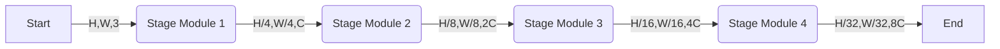

# Swin Transfomer

---
[TOC]



## Stage Module (Use module 2 as example)


### Partition Merge


#### Unfolder Reshape

实际上Unfold的作用如下图所示

@import "http://cdn.dianhsu.top/img/20210524135033.svg" {width=500}

输入数据是一个 $H,W,C$ 的立方体，Unfolder Reshape的作用是将它切分成 $ds, ds, C$ 的小立方体立方体。那么立方体的个数是$\frac{W \times H}{ds^2}$，将小立方体的数据排成一排。得到的输出就是$[\frac{W \times H}{ds^2}, ds^2 \times C ]$。


#### Linear


##### Matrix Multiply

这样的话，我们设定矩阵乘法中同时计算元素的数量是$C$，值得一提的是$C$在官方的版本中是$96$。

@import "PartitionMerge/MatrixMultiply/main.cpp" {class="line-numbers"}
这部分的运算，直接固化在FPGA上面
这样的话，Linear中调用Matrix Multiply的代码应该是这样子
$$
\text{Input Blocks:} [\alpha] \\
\text{Output Blocks:} [\beta] \\
\text{Params Blocks:} [\alpha][\beta] \\
\text{Linear}_{j} = \sum_{i=0}^{\alpha} \text{Input}[i] * \text{Params}[i][j]
$$

@import "http://cdn.dianhsu.top/img/20210524202305.svg" {width=500}

以下是实现代码

@import "PartitionMerge/MatrixMultiply/wrapper.cpp" {class="line-numbers"}

:balloon: ***有个小问题***：在实际操作中需要考虑用全局变量代替局部变量，以便减少数据拷贝次数。特别指的是`paramTmp`和`outputBoxTmp`。


##### 求和(add bias)
这部分的实现比较简单

```cpp
template<typename T, int C>
void add_bias(T* input1, T* input2, T* output){
    for(int i = 0; i < C; ++i){
#pragma HLS UNROLL
        output[i] = input1[i] + input2[i];
    }
}
```
### Swin Block


### Swin Block(Shift Window)